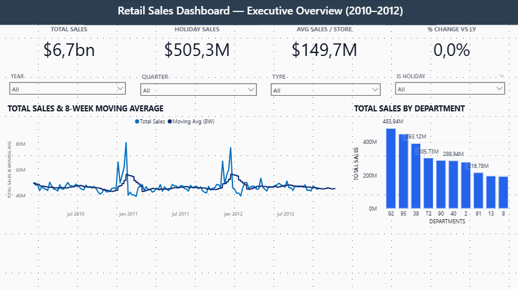

# Retail Sales Intelligence — Case Study

**Stack:** Power BI (DAX, Modeling), GitHub • **Dataset:** Kaggle (Features/Sales/Stores)

## 1) Business Question
Build an executive dashboard that tracks revenue, margin and seasonality; spot trends (MoM, YoY), holiday impact, and departments to prioritize.

## 2) Data & Modeling
- **Tables:** `sales data-set` (Date, Store, Dept, Weekly_Sales, IsHoliday),  
  `Features data set` (Date, Store, Temperature, Fuel_Price, CPI, Unemployment, MarkDowns),  
  `stores data-set` (Store, Type, Size).
- **Relationships:** Date ↔ Sales (1:*), Date ↔ Features (1:*), Store ↔ Features/Sales (1:*)  
- **Calendar:** Calculated Date table with Year, Month, MonthNo, YearMonth, YearMonthNo, Quarter.

## 3) Key Measures (examples)
- **Average Total Sales** – sum of Weekly_Sales by current filters.  
- **Sales YoY %** – YoY change % by YearMonth.  
- **Avg Temperature °C** – daily average (F → °C) with `TREATAS` to respect Date filter.

## 4) Highlights / Insights
- **Holiday share ~7.5%** of sales (2010–2012 sample).  
- **Avg temperature ~15.2°C** over the period (daily filter-aware).  
- Seasonality visible in the **Monthly Sales Trend**; some months spike, others dip.  
- The **Top Dept (by Profit)** visual identifies winners across years.

## 5) Visuals (screens)
- Executive Overview, Monthly Sales Trend, Profitability view.  
  
  
  

## 6) Recommendations
- Prepare inventory/marketing for seasonal peaks.  
- Track holiday campaigns; A/B markdown strategies by dept.  
- Monitor CPI/Unemployment for macro-pressure on demand.

## 7) Next Steps
- Upload PBIX (using Git LFS, or share a PDF export/MP4 demo).  
- Add dept/store drilldowns; simple forecasting (ARIMA/Prophet) as a companion.

*Author: Diego Porto — 2025*
